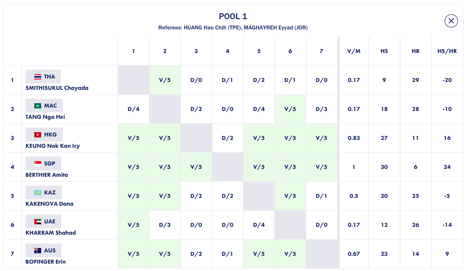

## Pool Scraping 

**Context:** In a fencing competition, there are two phases, pools and direct elimination (DE's). During 'Pools' fencers are split into groups of 5 to 7 (distributed based on initial rankings) where they fence a round robin (every person fences every other person). The results from each pool is used to compile an over ranking for the fencers for the Direct Elimination round. Direct Elimination usually follows a simple elimination bracket. 

As part of the records of previous competitions, the FIE stores the results from every pool in a competition, which can be found on a competition [page](https://fie.org/competitions/2020/771) under "Results > Pools". Below is an example of the pools information:

**Goal:** The goal for this piece of the project is to take the html associated with a single pool and return two arrays: the first with a list of fencers and their IDs (as used on the FIE website) and the second a grid of scores from the matches. 

*Issues*
* If a fencer wins in overtime, they will have a V2-2 score, so need to keep track of score but also victories. 
* Rows have a filler corresponding to the fencer themselves, so need to keep track of which fencer is being processed. To handle this, first create an array with scores and one indicating winners and then process the data after scraping. 